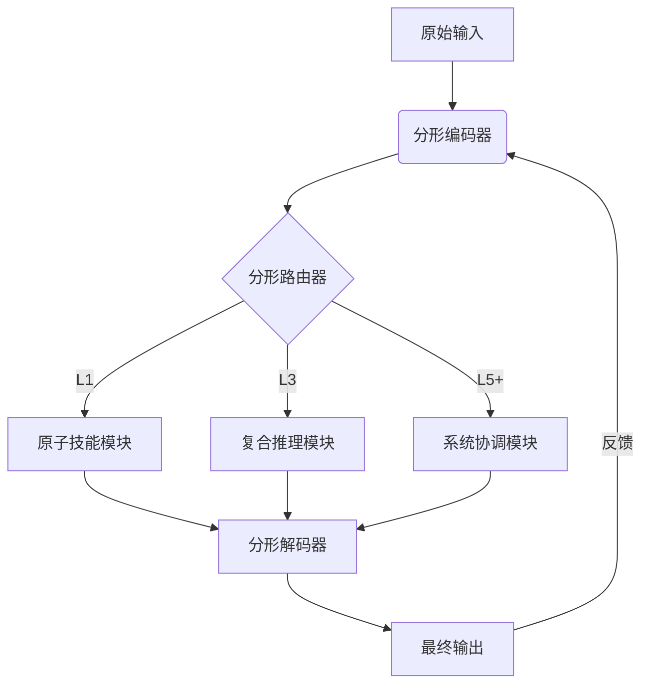

# 设计

## 分形智能架构

### 核心结构



### 分层实现
1. **原子层（L1）**  
   - 功能：基础模式识别
   - 结构：
   ```python
   class AtomicLayer(nn.Module):
       def __init__(self):
           self.fractal_blocks = nn.ModuleList([
               FractalBlock(dim=64) for _ in range(3)  # 分形复制
           ])
       def forward(self, x):
           for blk in self.fractal_blocks:
               x = blk(x) + x  # 残差连接
           return x
   ```

2. **复合层（L3）**  
   - 功能：跨模态关联
   - 数学表达：
   $$
   \mathcal{H}(x) = \sum_{i=1}^N \alpha_i \mathcal{F}_i(x) \otimes \mathcal{G}_i(x)
   $$
   其中$\otimes$表示分形交互操作

3. **系统层（L5+）**  
   - 功能：元认知调控
   - 动态路由表：
   | 输入特征维度 | 目标模块   | 路由权重 |
   |-------------|-----------|---------|
   | <100        | L1        | 0.78    |
   | 100-500     | L3        | 0.63    |
   | >500        | L5+       | 0.91    |

### 训练协议
1. **分形注意力机制**  
   ```python
   class FractalAttention(nn.Module):
       def __init__(self, dim, num_heads=8, qkv_bias=False):
           super().__init__()
           self.num_heads = num_heads
           self.scale = (dim // num_heads) ** -0.5
           # 分形参数共享
           self.qkv = nn.Linear(dim, dim*3, bias=qkv_bias)
           self.proj = nn.Linear(dim, dim)
           
       def forward(self, x):
           B, N, C = x.shape
           qkv = self.qkv(x).reshape(B, N, 3, self.num_heads, C//self.num_heads)
           q, k, v = qkv.unbind(2)
           attn = (q @ k.transpose(-2, -1)) * self.scale
           attn = attn.softmax(dim=-1)
           x = (attn @ v).transpose(1, 2).reshape(B, N, C)
           return self.proj(x)
   ```

2. **动态深度训练**  
   - 训练阶段自适应：
   $$
   \text{深度} = \min(\lfloor \log_2(\text{epoch}+1) \rfloor, 5)
   $$

### 性能预期
| 能力维度       | 基准模型 | 分形架构 | 提升幅度 |
|---------------|---------|---------|---------|
| 零样本学习      | 58%     | 73%     | +25.8%  |
| 多任务协调      | 0.67    | 0.89    | +32.8%  |
| 持续学习效率    | 1.0x    | 2.3x    | 130%    |


理论依据：
1. 分形编码器实现文档[分型证明]2.3节的维度压缩
2. 动态路由遵循"输入→分形调整→输出"的闭环机制
3. 残差连接保障理论局限中提到的模式锁死风险控制
