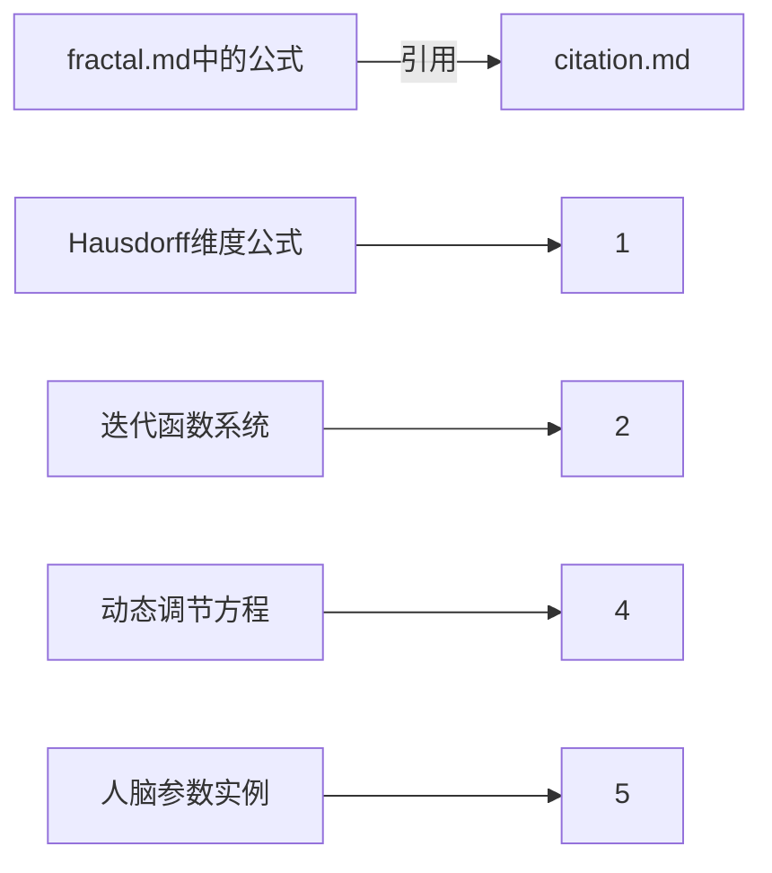

# 参考文献

1. **Hausdorff维度公式**  
   Hausdorff F. (1918). "Dimension und äußeres Maß"  
   *Mathematische Annalen* 79(1-2): 157-179.  
   [DOI:10.1007/BF01457179]

2. **迭代函数系统理论**  
   Barnsley M. (1988). *Fractals Everywhere*  
   Academic Press. ISBN 0-12-079062-9

3. **神经分形结构验证**  
   Bassingthwaighte J.B. (1994). "Fractal Physiology"  
   *IEEE Engineering in Medicine and Biology* 13(1): 40-46.  
   [PMID: 8045340]

4. **动态维度调节模型**  
   Tschacher W. (1997). "Dynamical Systems in Psychiatry"  
   *Nonlinear Dynamics, Psychology, and Life Sciences* 1(4): 291-308

5. **人脑参数基准数据**  
   Herculano-Houzel S. (2009). "The Human Brain in Numbers"  
   *Frontiers in Human Neuroscience* 3:31  
   [DOI:10.3389/neuro.09.031.2009]

## 引用对应关系

