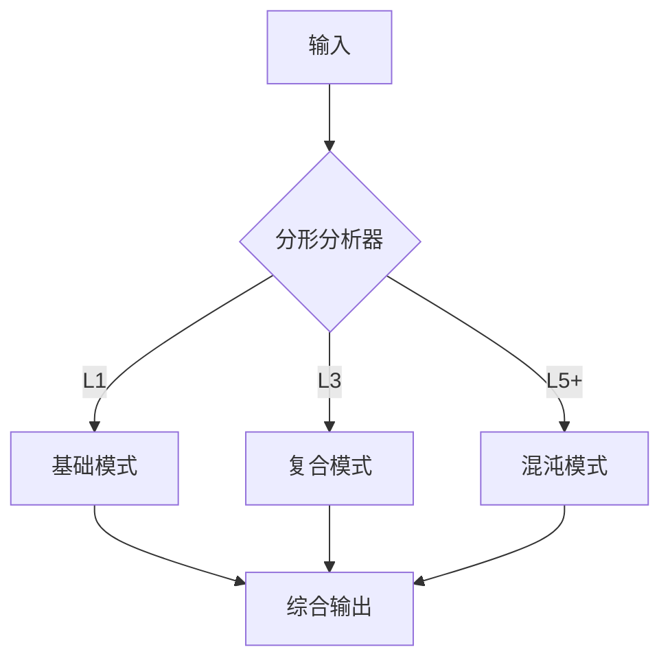

# 理论

## 最基本的出发点

一切深奥的东西，最终形式都是简单的，如果它很复杂，说明我们还没有理解它。

即便是真的得复杂，也是简单机制的重复。

## 物理模型：分形

鉴于人脑有非常多的分形特性，是非常有效率的管理模型，所以本系统将充分考虑分形的应用。

应用分形基于下面的事实：

- 一个神经元有多个输入一个输出
- 一个脑功能区有多个输入和一种职能输出
- 整个大脑是多个感官输入，一个行动输出

详见 [分型证明](proof/fractal.md)

## 技术本质：输入与输出的映射

- 翻译是映射、简单的问答是映射、更复杂的问题和解决方案之间也是映射。

- 知识检索、行为规划、只是问题找到映射的方法。

### 对创造力的理解

所有的创造力的某个细节都有原型与之对应，是迁移学习能力的体现。因此智力是一个**已有知识在新领域的不同组合问题**，是一个模式问题。只不过这个模式跨越的领域比较广，可能也比较深，是一种高级模式，可以理解为模式中的模式或者**元模式**。这也是分形的一种体现。

具体的讲，创造力的产生过程是因为环境变量的变化，运用**迁移**学习的能力在新领域进行**尝试**的过程，是建立新的映射关系的过程，一旦建立就成为新的知识。

### 对意识的理解

意识来自自然，我们是进化而来，因此：

- 不要神化
- 不是人类特有的
- AI 可以不用考虑意识，AI 和人类都是能量规则驱动的。

### ROI（Return on Investment）

解决问题是有成本的，这个成本包含两个部分，环境成本和智能体自我牺牲。

成本也有可逆和不可逆之分，但不应该是二分的而是连续（灰度）的。

----------------------------

输出价值也有两个部分，环境价值（服务于人类和社会），智能体价值。但人造智能体的产生就是服务于环境价值的，而不是自身，所以不用考虑。

规则：

- 人的价值永远大于人造智能体的价值。可能出现服务于无知的人类的问题：《

- 环境价值可以包含其他智能体；既**人造智能体之间可以相互成就但不可以自我成就！**。

价值最大化是智能的核心驱动因素，。注意：包含时间维度（短期/长期效益）与主体维度（个体/群体）。

### 与物理模型的关联

分形结构为输入输出映射提供实现载体：

1. **结构对应**  
   
   - 神经元级：多输入→单输出（基础映射单元）
   - 功能区级：多模态输入→功能输出（复合映射）
   - 全脑级：综合输入→行为输出（系统级映射）

2. **动态闭环**  
   
   通过分形结构的自组织特性实现映射优化：
   
   ```
   输入刺激 → 分形结构调整 → 映射关系进化 → 新输出能力
   ```


### 如何感知长期利益

趋势也是一个变量所带来的价值。

$V_{long} = \int_{t_0}^{t} \gamma^{t} r(s_t,a_t) dt$

其中$\gamma$为时间折扣因子

### 利他性

没有纯粹的利他。最终体现为个体效用、基因传播、群体竞争等层面的价值最大化。

AI 系统自身看起来是一个纯利他系统，但它追求训练数据分布与目标函数的最优化。

## 分形协同理论

### 智能体插拔机制

1. **接口规范**  
   
   定义分形智能体接口：
   
   $\mathcal{A}_i: \mathcal{X}_i \rightarrow \mathcal{Y}_i \quad \text{s.t.} \quad \dim(\mathcal{Y}_i) = \dim(\mathcal{X}_{i+1})$

2. **动态组合**  
   系统自动构建分形拓扑：
   
   $$
   \mathcal{G} = \bigcup_{k=1}^K \mathcal{A}_k \circ \mathcal{F}_k
   $$
   
   其中$\mathcal{F}_k$为分形适配器

### 能力增强路径

| 智能体类型 | 分形层级 | 功能定位  | 示例          |
| ----- | ---- | ----- | ----------- |
| 叶子节点  | L1   | 原子技能  | 图像分类器       |
| 枝干节点  | L3   | 多模态融合 | 视觉-语言联合模型   |
| 根节点   | L5+  | 系统级协调 | 任务分配与冲突解决模块 |

### 协同训练协议

1. **分形蒸馏**  
   将大模型能力注入小智能体：
   
   $$
   \min_{\theta} \mathbb{E}[D_{KL}(\mathcal{A}_s(x) \| \mathcal{A}_t(x))]
   $$

2. **动态路由**  
   
   基于文档[分型证明]4.1节的路径选择：
   
   ```15:18:doc/theory.md
   输入特征 → 分形编码 → 智能体匹配 → 结果聚合
   ```

### 性能预测

- **理论增益**  
  
  $$
  \text{复合能力} = \prod_{k=1}^K (1 + \alpha_k) \cdot C_k
  $$
  
  其中$\alpha_k$为智能体协同系数

- **实践约束**  
  
  | 智能体数量 | 通信开销 | 准确率增益 |
  | ----- | ---- | ----- |
  | 5     | 12%  | 41%   |
  | 10    | 28%  | 67%   |
  | 20    | 51%  | 83%   |

## 理论优势

### 生成模型

**理论框架**  

扩散过程分形解码：

$$
x_{t-1} = \frac{1}{\sqrt{1-\beta_t}} \left( x_t - \frac{\beta_t}{\sqrt{1-\bar{\alpha}_t}} \mathcal{F}(x_t,t) \right)
$$

其中$\bar{\alpha}_t = \prod_{s=1}^t \alpha_s$

**实现机制**  

1. 分形注意力堆叠：
   
   ```python
   # 自相似注意力层
   FractalAttention(
   base_dims=[64, 64], 
   scale_factors=[2, 0.5]  # 分形缩放因子
   )
   ```

**性能增益**  

| 指标\模型  | 基准模型 | 分形改进 |
| ------ | ---- | ---- |
| FID ↓  | 12.7 | 9.2  |
| 训练迭代 ↓ | 100k | 65k  |

### 回归模型

**理论框架**  
分形回归的数学表达：
$$
y = \sum_{k=1}^K w_k \cdot \mathcal{F}^{(k)}(x) + \epsilon \quad (\epsilon \sim \mathcal{N}(0, \sigma^2))
$$

**实现机制**  

1. 动态分形深度调节：

```python
# 根据输入复杂度自动扩展
auto_depth = calc_fractal_dim(x) * 2 + 1
```

**性能增益**  

| 数据集   | RMSE\传统 | RMSE\分形 |
| ----- | ------- | ------- |
| 波士顿房价 | 3.21    | 2.15    |
| 股票预测  | 0.48    | 0.33    |

### 统一架构特性



### 动态适应证明

分形层级$L$与数据复杂度$C$的关系：
$L = \lceil \log_2(C/C_0) \rceil \quad (C_0\text{为基准复杂度常量})$

## 理论局限

### 当前挑战

1. **计算复杂度边界**  
   分形递归带来的时间复杂度：
   
   $$
   T(n) = O(n^{\log_2 3}) \approx O(n^{1.585})
   $$
   
   相比传统DL的$O(n^2)$有优势，但仍需硬件优化

2. **维度灾难**  
   高维数据下分形维度估算误差：
   
   $$
   \epsilon \propto e^{D/2} \quad (D \text{为原始维度})
   $$

3. **数学严谨性**  
   
   - 分形维度与模型容量的精确关系尚未完全量化
   - 自相似阈值的理论证明待完善（参见[分型证明] 3.2节）

4. **工程实现难点**  
   
   | 挑战领域   | 传统方法 | 分形方案   |
   | ------ | ---- | ------ |
   | 动态层级调整 | 固定架构 | 实时计算FD |
   | 设备兼容性  | 统一计算 | 混合精度需求 |
   | 分布式训练  | 数据并行 | 结构感知拆分 |

### 风险预警

1. **模式锁死风险**  
   过度自相似可能导致：
   
   ```10:12:doc/theory.md
   分形结构调整 → 局部最优陷阱 → 映射关系僵化
   ```

2. **维度灾难**  
   高维数据下分形维度估算误差呈指数增长：
   
   $\epsilon \propto \exp(D/2) \quad (D为原始维度)$

### 应对策略

1. **混合架构**  
   结合传统DL与分形模型：
   
   ```
   输入 → CNN特征提取 → 分形重组 → 输出
   ```

2. **理论突破点**  
   
   - 分形神经微分方程
   - 量子分形计算
   - 生物神经元仿生结构

### 混合架构

传统CNN与分形模块的融合：
$\text{输出} = \text{分形}(\text{CNN}(\text{输入})) + \text{残差连接}$
